# 📘 MANUAL DE UTILIZAÇÃO — SISTEMA ROLETAFLOW

**Versão:** 1.0 — **Ambiente de Teste**  
**Data:** 23/03/2026  
**Responsável:** Yuri / Equipe de TI

---

## SUMÁRIO

1. Introdução  
2. Objetivo do Sistema  
3. Perfis de Usuário  
4. Acesso ao Sistema  
5. Fluxo de Trabalho — Operador (Catraqueiro)  
6. Fluxo de Trabalho — Administrador / Tráfego  
   - 6.1 Dashboard Administrativo  
   - 6.2 Gerenciar Empresas  
   - 6.3 Gerenciar Veículos  
   - 6.4 Registrar Leitura (Admin)  
   - 6.5 Relatórios  
7. Fluxo de Trabalho — Bilhetagem  
8. Divergências e Procedimentos Operacionais  
9. Funcionamento Offline  
10. Exportação e Relatórios  
11. Erros Comuns e Soluções  
12. Suporte  
13. Glossário 

---

## 1. Introdução

O RoletaFlow é uma plataforma desenvolvida para registrar, analisar e controlar leituras de catracas físicas e eletrônicas dos veículos da frota.  
O sistema foi projetado para ser:

- Rápido  
- Responsivo (celular, tablet e desktop)  
- Funcionar offline  
- Suportar alto volume de registros (300–400 veículos por madrugada)

Ele atende operadores, tráfego, bilhetagem e o órgão gestor (COC), garantindo rastreabilidade e precisão nas informações.

---

## 2. Objetivo do Sistema

O RoletaFlow tem como finalidade:

- Padronizar o processo de vistoria das catracas  
- Reduzir divergências entre catraca física e eletrônica  
- Facilitar o trabalho do catraqueiro  
- Fornecer relatórios completos para bilhetagem e tráfego  
- Identificar divergências críticas que exigem parada do veículo  
- Registrar informações para lacre/deslacre pelo órgão gestor (COC)

---

## 3. Perfis de Usuário

### 3.1 Operador (Catraqueiro)

- Registra leituras físicas e eletrônicas  
- Marca ocorrências (validador com defeito, leitura ilegível etc.)  
- Acompanha o progresso diário  
- Opera principalmente durante a madrugada  
- Utiliza o sistema em modo offline quando necessário

### 3.2 Administrador / Controlador de Tráfego

- Visualiza todos os registros  
- Acompanha divergências  
- Identifica veículos que precisam ser parados  
- Gerencia empresas e veículos  
- Exporta relatórios

### 3.3 Bilhetagem

- Analisa divergências  
- Corrige inconsistências  
- Gera relatórios de auditoria  
- Acompanha histórico por veículo

### 3.4 COC — Órgão Gestor

- Atua em divergências críticas  
- Realiza lacre e deslacre  
- Ajusta giros oficialmente  
- Atua em horário comercial

---

## 4. Acesso ao Sistema

O sistema é acessado pelo mesmo link para todos os usuários:  
[https://roletaflow.onrender.com](https://roletaflow.onrender.com)  

O que muda é o perfil, que define quais módulos aparecem.

### 4.1 Login

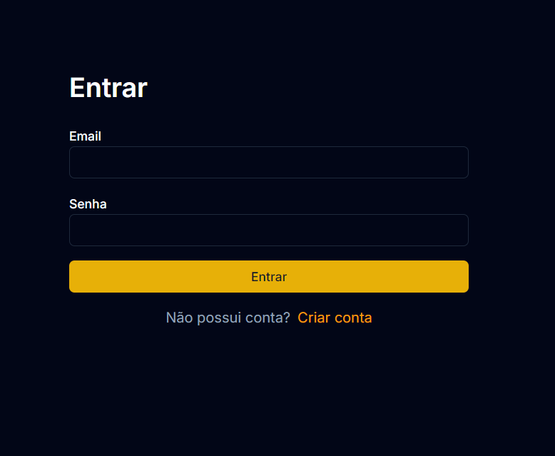

- Informar e-mail  
- Informar senha  
- Clicar em Entrar  

Usuários são criados pela TI ou administrador.

---

## 5. Fluxo de Trabalho — Operador (Catraqueiro)

### 5.1 Tela Inicial
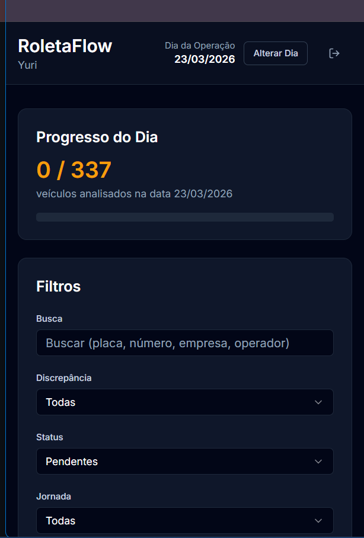
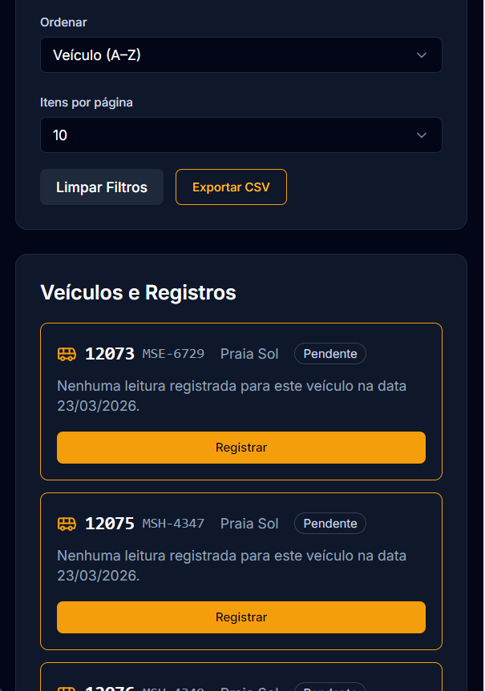

O operador visualiza:

- Progresso do dia (ex.: 0/337 veículos analisados)  
- Lista de veículos pendentes  
- Botão **Registrar** para cada veículo  

### 5.2 Registro de Leitura
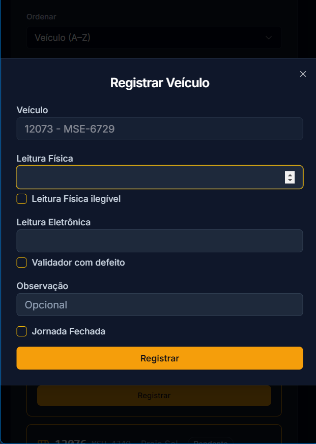

Ao clicar em **Registrar**, o operador preenche:

**Campos obrigatórios:**  
- Leitura Física  
- Leitura Eletrônica  

**Ocorrências opcionais:**  
- Leitura física ilegível  
- Validador com defeito  
- Observação  

Após registrar:

- O veículo sai da lista  
- O progresso é atualizado  
- O registro é sincronizado (online ou quando a internet voltar)

---

## 6. Fluxo de Trabalho — Administrador / Tráfego

### 6.1 Dashboard Administrativo

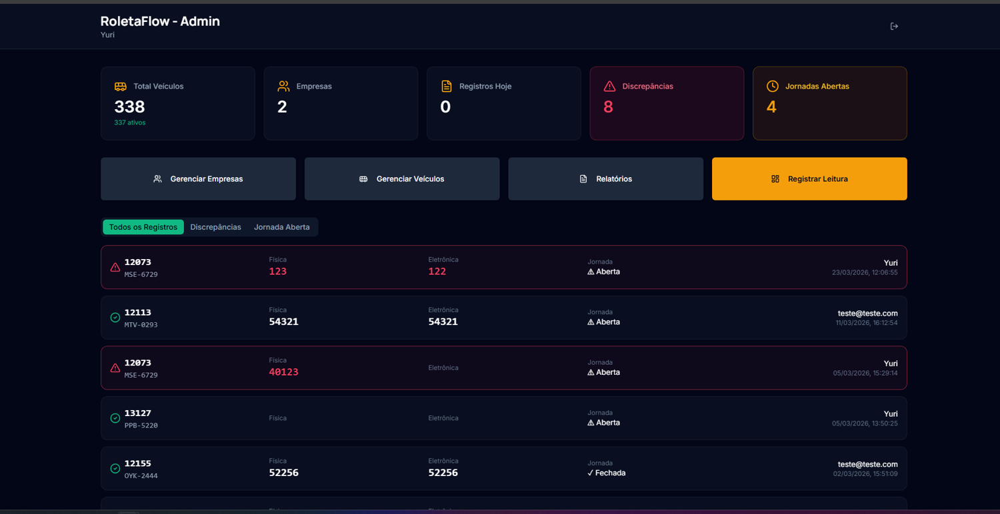

O administrador visualiza:

- Total de veículos  
- Empresas cadastradas  
- Registros do dia  
- Divergências  
- Jornadas abertas  

Abas disponíveis:

- **Todos os Registros**  
- **Discrepâncias**  
- **Jornada Aberta**  

Cada registro exibe:

- Número do veículo  
- Placa  
- Leitura física  
- Leitura eletrônica  
- Jornada  
- Operador  
- Data e hora do lançamento  

---

## 6.2 Gerenciar Empresas

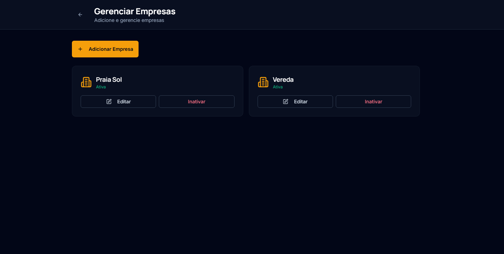

Nesta tela, o administrador pode:

- Adicionar novas empresas  
- Editar empresas existentes  
- Inativar empresas  

Cada empresa exibe:

- Nome  
- Status  
- Botões de ação  

---

## 6.3 Gerenciar Veículos

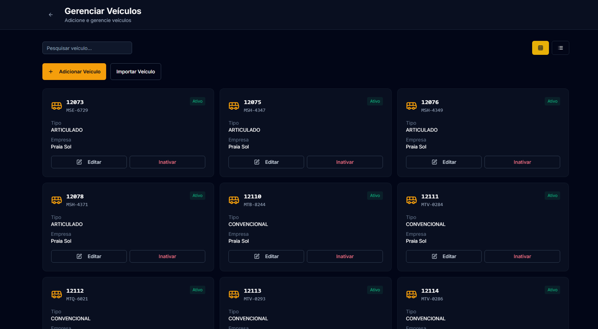  
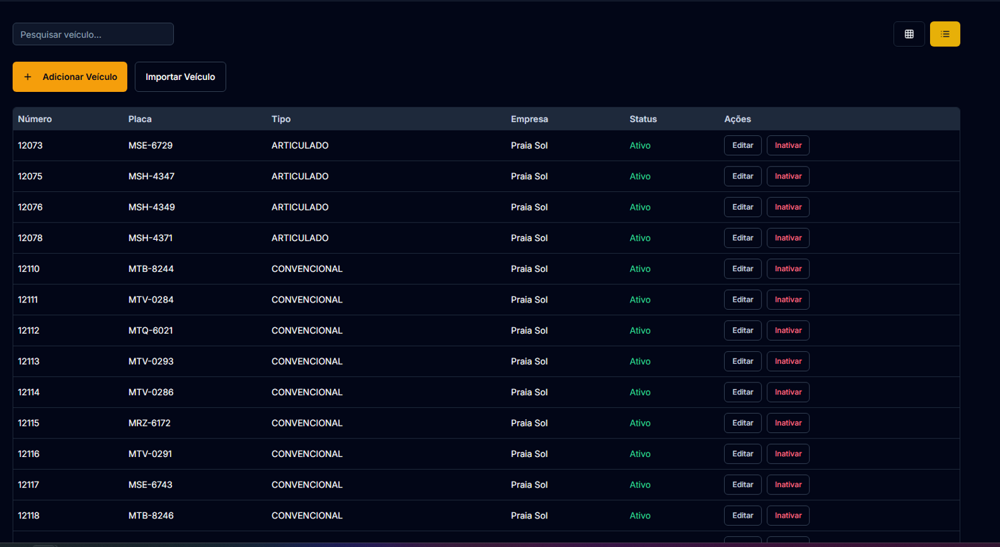

O administrador pode:

- Adicionar veículos  
- Importar veículos  
- Editar veículos  
- Inativar veículos  

Cada veículo exibe:

- Número  
- Placa  
- Tipo  
- Empresa  
- Status  

### 6.3.1 Adicionar Veículo

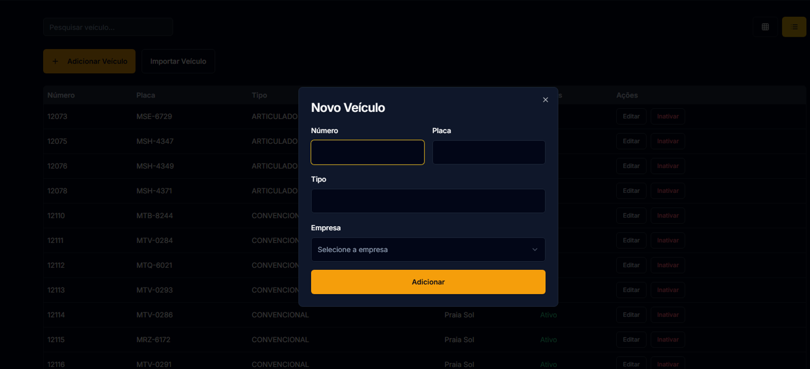

Campos:

- Número  
- Placa  
- Tipo  
- Empresa  

---

## 6.4 Registrar Leitura (Admin)

O administrador também possui permissão para registrar leituras manualmente.  
A funcionalidade é **idêntica à utilizada pelo operador**, porém a interface exibida depende do dispositivo:

### • Versão Desktop (Admin)
Quando acessado pelo computador, o administrador visualiza uma tela mais ampla, com filtros adicionais e layout otimizado para produtividade.

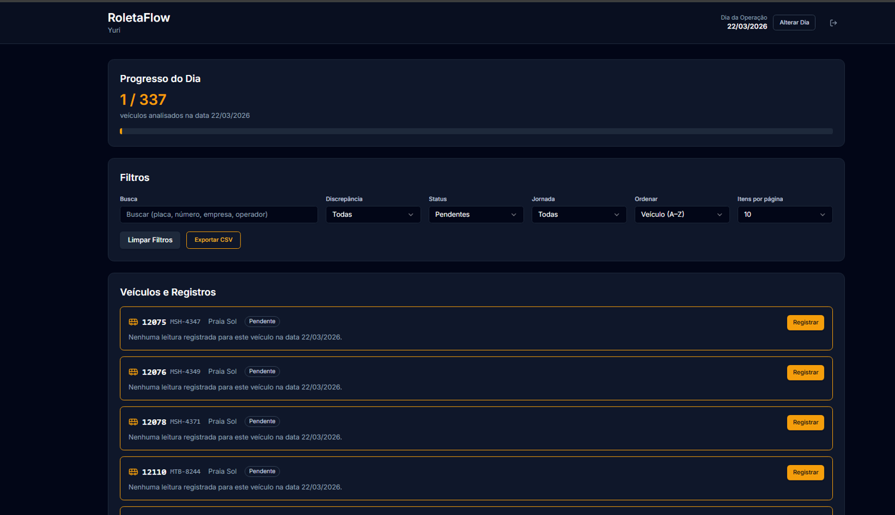

### • Versão Mobile (Operador)
Quando acessado pelo celular ou tablet, a interface é compactada automaticamente, exibindo apenas os campos essenciais para agilizar o trabalho do operador.

A lógica de registro é a mesma:

- Leitura Física  
- Leitura Eletrônica  
- Leitura Física Ilegível  
- Validador com Defeito  
- Observação  
- Jornada Fechada  

### Quando o Admin utiliza essa função?
- Para registrar leituras atrasadas  
- Para corrigir registros incorretos  
- Para registrar veículos que passaram sem vistoria  
- Para auxiliar o operador em caso de falhas no dispositivo  
- Para auditoria interna ou conferência de dados

> **Observação:**  
> Mesmo com telas diferentes, o processo de registro é exatamente o mesmo.  
> A diferença está apenas na interface adaptada ao dispositivo (desktop vs. mobile).

---

## 6.5 Relatórios

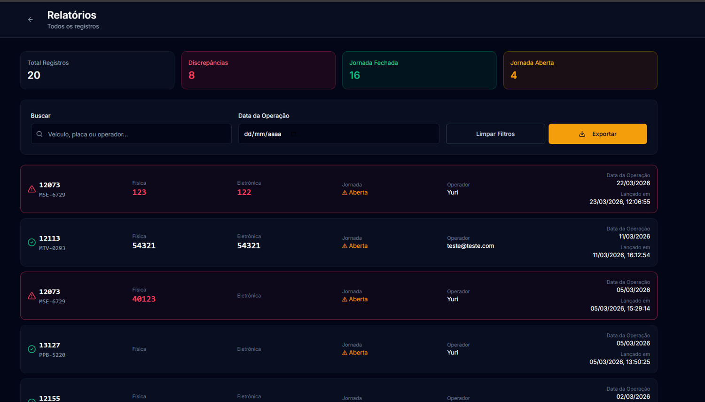

A tela de relatórios permite:

- Filtrar por veículo, placa, operador  
- Selecionar data da operação  
- Ver totais:  
  - Registros  
  - Discrepâncias  
  - Jornadas fechadas  
  - Jornadas abertas  
- Exportar dados  

Cada registro exibe:

- Número do veículo  
- Placa  
- Leitura física  
- Leitura eletrônica  
- Jornada  
- Operador  
- Data da operação  
- Data do lançamento  

---

## 7. Fluxo de Trabalho — Bilhetagem

### 7.1 Relatório de Divergências

A bilhetagem acessa:

- Todas as divergências do dia  
- Histórico por veículo  
- Leituras física e eletrônica  
- Ocorrências marcadas pelo operador

### 7.2 Correção

A bilhetagem:

- Ajusta leituras  
- Valida registros  
- Gera relatórios internos  
- Identifica padrões de erro

---

## 8. Divergências e Procedimentos Operacionais

O sistema identifica automaticamente divergências entre catraca física e eletrônica.

### 8.1 Tipos de Divergência

| Tipo                      | Descrição                      | Quem vê                     | Ação                                                                                     |
|---------------------------|-------------------------------|-----------------------------|------------------------------------------------------------------------------------------|
| Diferença leve (1–2 giros) | Divergência pequena            | Tráfego + Bilhetagem + COC  | Tráfego opera normalmente apesar da divergência; deve solicitar correção oficial ao COC em contato com a CETURB.  |
| Diferença crítica (>2 giros) | Pode indicar falha grave ou fraude | Tráfego + Bilhetagem + COC  | Parar veículo imediatamente e acionar COC para correção oficial.                         |
| Validador com defeito      | Operador marcou                | Tráfego + Bilhetagem        | Verificar equipamento.                                                                   |
| Leitura ilegível           | Operador marcou                | Bilhetagem                  | Ajuste manual.                                                                           |

### 8.2 Regra Operacional — Divergência Crítica

Quando a diferença ultrapassa 2 giros:

- O veículo deve ser parado imediatamente  
- O tráfego deve ser notificado  
- O COC deve ser acionado para:  
  - Lacre  
  - Deslacre  
  - Ajuste oficial dos giros

### 8.3 Fluxo Operacional por Horário

- **Madrugada — Catraqueiro:** registra apenas  
- **Operação — Tráfego:** acompanha divergências, para veículos, aciona o COC  
- **Dia — COC:** realiza lacre/deslacre, ajusta giros, registra ações oficiais

---

## 9. Funcionamento Offline

- Armazena registros localmente  
- Permite registrar sem internet  
- Sincroniza automaticamente quando a conexão volta  

Ideal para pátios e garagens.

---

## 10. Exportação e Relatórios

Disponível para:

- Administrador  
- Bilhetagem  

Formatos:

- CSV  
- Filtros por empresa, operador, divergência, etc.

---

## 11. Erros Comuns e Soluções

| Problema | Possível causa | Solução |
|-----------|----------------|---------|
| Não consigo registrar leitura | Sem internet ou sincronização pendente | Aguardar sincronização |
| Registro não aparece | Cache ou sincronização | Atualizar página |
| Não consigo fazer login | Senha incorreta | Solicitar redefinição |
| Veículo não aparece | Data incorreta | Verificar data do sistema |

---

## 12. Suporte

Para suporte técnico:

- Equipe de TI  
- Administrador do sistema  

Informar sempre:

- Veículo  
- Horário  
- Operador  
- Print da tela

---

## 13. Glossário

- **Catraca Física:** contador mecânico do veículo  
- **Catraca Eletrônica:** contador do validador  
- **Divergência:** diferença entre física e eletrônica  
- **COC:** órgão gestor responsável por lacre/deslacre  
- **Validador:** equipamento de bilhetagem  
